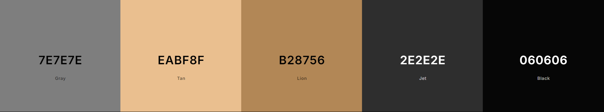
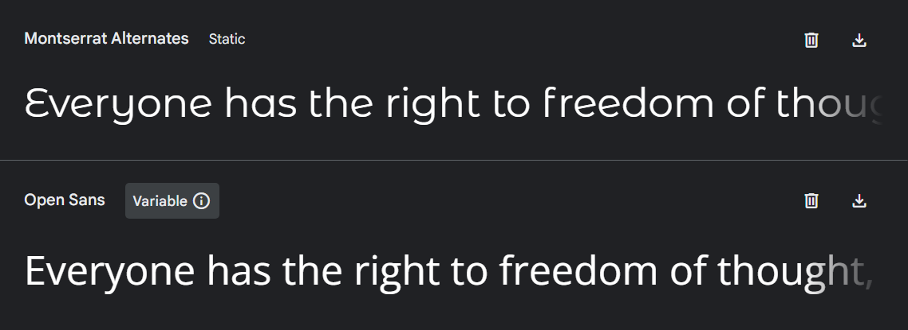

<h1 align="center">
<picture>
  
</picture>
    
AWAX – SITE DESENVOLVIDO PARA PRÁTICA DE FLEXBOX

</h1>

 
    <a href="#Layout-Web">Layout Web</a> |
    <a href="#Tablet">Layout Tablet-Mobile</a> |
    <a href="#Sobre">Sobre</a> |
    <a href="#Contato">Contato</a>

 

### Resumo:
O objetivo principal deste projeto é colocar em prática tudo o que foi estudado sobre FlexBox no curso da B7Web.

### Desenvolvido até aqui:

- [x] Estrutura HTML/CSS
- [x] Responsividade
- [x] JavaScript
- [ ] Animações JS

### Tecnologias Utilizadas:

  
  
  
  
  

  
 
---

### Layout Web:
Page desenvolvida priorizando o [HTML Semântico](https://github.com/luruanx/Projeto-Awax/blob/main/index.html) e as
[CSS responsiva](https://github.com/luruanx/Projeto-Awax/tree/main/assets/css). 
 
 

 
    <a href="https://luruanx.github.io/Projeto-Awax/">Clique aqui e veja o resultado</a>

https://github.com/user-attachments/assets/7c84269f-4d21-44d0-a5b1-2fa1d5ba4ee0

 
 

### Tablet e Mobile:

 
    <a href="https://luruanx.github.io/Projeto-Awax/">Responsivo em qualquer tamanho de tela</a>

https://github.com/user-attachments/assets/5d687af2-c81a-425e-8fd2-ee0342650f62

 

 
  

### Sobre:

- ### De onde veio a inspiração? 

  Durante o curso foi nos disponibilizados um layout para que pudéssemos desenvolver seguindo o design.  

- ### Identidade Visual

  **Logomarca:** Genérica encontrada no [Vecteezy](https://www.vecteezy.com/).    

  **Paleta de Cores:** 

    
  

    
  
    

  **Font-Family:**

   

  

    

---

### Contato:

  

  Estou total aberto a conselhos, elogios ou sugestões. **"Todo conhecimento é bem vindo!"**, dar um alô aí!!

   

